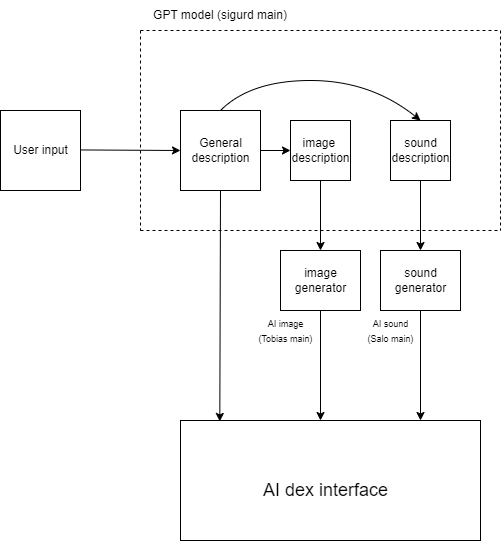
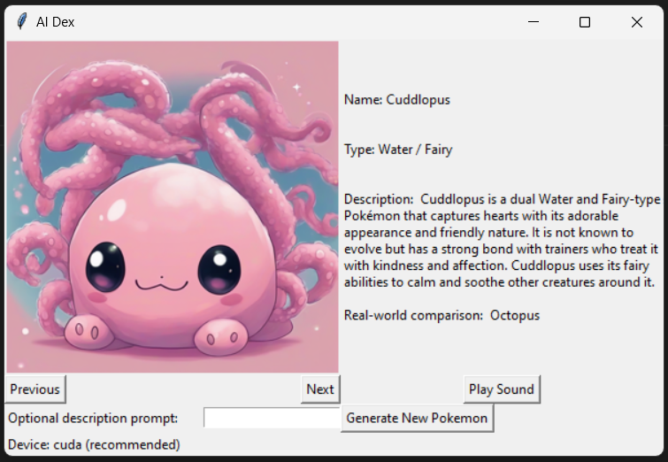

# Generative-AI-project

This is a project regards generating pokemon inspired creatures with the use of generative AI, and listing them in our AI dex. This project is not for any official or monetary purposes.

The user will be able to input some prompt (optional) containing the name, visual descriptions, descriptive terms and/or type. This is input the ChatGPT, where the model outputs a name, type, dex description, visual description and an auditory description. The name, type and description is directly displayed in the AI dex. If there is no prompt, a random pokemon will be generated. The visual description is sent to a diffusion model, which generates an image. This image creates a visual for the generated pokemon. The auditory description is sent to an AudioLDM model, which generates a sound, this sound represents the sound of the generated pokemon.

The interface in launched when the user runs main.py. The required packages are included in requirements.txt, additionally the user need to run the line "pip3 install torch torchvision --index-url https://download.pytorch.org/whl/cu118" to make the usage of the CPU available for the image and sound generation (recommended). We recommend running the AI dex with python version 3.12.2.

AI dex backend structure:

Known issues:
The sound generator does not generate reasonable sounds. We have repeatedly tried to optimize the inputs, and changing the model itself, to no avail.

Generating a new pokemon takes time. On our machine, with the given packages and versions, it takes about 3 minutes to generate a new pokemon, with cuda enabled. We recommend using GPU to generate new pokemons, as without it, it can take up to 20 minutes.

The AI dex interface freezes during the creation of a new AI generated pokemon.

Here is an example of a generated pokemon in the AI dex:

In the interface, there are 4 buttons. The "play sound" button plays 1 of 3 generated sounds for the generated pokemon, at random. "Generate New Pokemon" generates a new pokemon based on the input prompt in the text box on its right (input prompt is optional). The "previous" and "next" buttons allows the user to browse previously created pokemons.

To run the AI Dex program, clone this repository and run the line "python src/main.py" from the Generative-AI-project directory in the terminal, after installing the required packages.

Below is a recording of our AI Dex interface, where we quickly peruse some previously generated pokemon-like creatures, and generate a new one. We play some of its sounds at the end, note that one of the sounds is a load screech, due to the lack of performance of our sound synthesis model.

